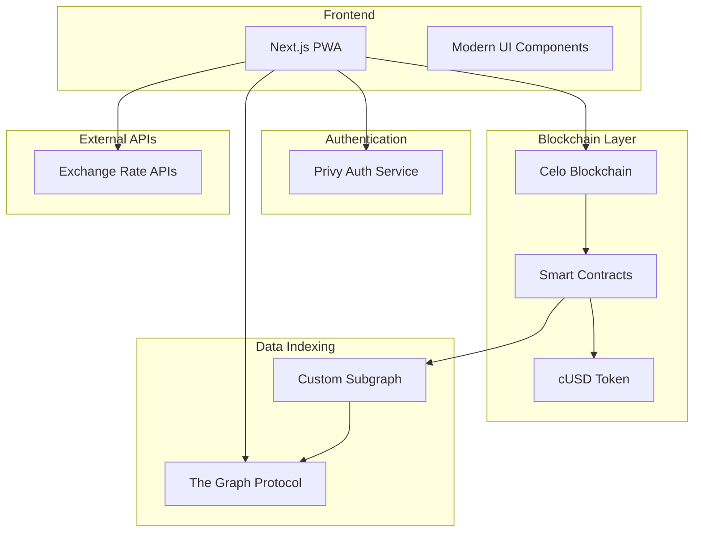

# Design Document

## Overview

The crypto payment platform will be built as a simple, modern Next.js application that leverages Celo blockchain for all payment processing and data storage. The architecture eliminates traditional backend services by using smart contracts for business logic, The Graph for data querying, and Privy for seamless wallet authentication. This approach creates a truly decentralized payment platform with minimal infrastructure complexity.

## Architecture

### High-Level Architecture



### Technology Stack

**Frontend:**
- Next.js with TypeScript
- Tailwind CSS for modern styling
- Privy for wallet connection and authentication
- Celo SDK for blockchain interactions

**Blockchain:**
- Celo blockchain for all transactions and data
- Smart contracts in Solidity
- cUSD as primary currency
- The Graph for blockchain data indexing

**Data & APIs:**
- The Graph Protocol for GraphQL queries
- Custom subgraph for transaction indexing
- Exchange rate APIs for currency conversion
- Local storage for user preferences

## Components and Interfaces

### Core Smart Contracts

#### 1. Payment Contract
```solidity
contract PaymentProcessor {
    struct Payment {
        address payer;
        address payee;
        uint256 amount;
        string description;
        uint256 timestamp;
        PaymentStatus status;
    }
    
    struct Business {
        address owner;
        string name;
        string category;
        bool isActive;
        uint256 totalEarnings;
    }
    
    mapping(bytes32 => Payment) public payments;
    mapping(address => Business) public businesses;
    mapping(address => uint256) public loyaltyPoints;
    
    function processPayment(address payee, uint256 amount, string memory description) external;
    function registerBusiness(string memory name, string memory category) external;
    function addLoyaltyPoints(address user, uint256 points) external;
}
```

#### 2. Loyalty Contract
```solidity
contract LoyaltySystem {
    struct UserTier {
        uint256 level;
        uint256 points;
        uint256 transactionCount;
        uint256 streakDays;
    }
    
    mapping(address => UserTier) public userTiers;
    mapping(uint256 => TierBenefits) public tierBenefits;
    
    function updateUserActivity(address user) external;
    function calculateRewards(address user, uint256 amount) external view returns (uint256);
    function claimRewards(address user) external;
}
```

### Frontend Components

#### 1. Wallet Management
```typescript
interface WalletManager {
  connectWallet(): Promise<void>
  getBalance(): Promise<string>
  sendPayment(to: string, amount: string, description: string): Promise<string>
  getTransactionHistory(): Promise<Transaction[]>
}

// Using Privy for authentication
import { usePrivy, useWallets } from '@privy-io/react-auth'

const WalletComponent = () => {
  const { login, logout, authenticated } = usePrivy()
  const { wallets } = useWallets()
  
  // Component implementation
}
```

#### 2. Payment Interface
```typescript
interface PaymentProcessor {
  generateQRCode(amount: string, description: string): Promise<string>
  scanQRCode(): Promise<PaymentData>
  processPayment(paymentData: PaymentData): Promise<TransactionResult>
}

// Using Celo SDK
import { newKit } from '@celo/contractkit'

const PaymentComponent = () => {
  const kit = newKit('https://alfajores-forno.celo-testnet.org')
  
  const processPayment = async (to: string, amount: string) => {
    const cUSD = await kit.contracts.getStableToken()
    const tx = await cUSD.transfer(to, amount)
    return tx
  }
}
```

#### 3. Business Dashboard
```typescript
interface BusinessManager {
  registerBusiness(name: string, category: string): Promise<void>
  updatePricing(productId: string, price: string): Promise<void>
  getEarnings(): Promise<EarningsData>
  generatePaymentQR(amount: string): Promise<string>
}
```

### GraphQL Schema (The Graph)

```graphql
type Payment @entity {
  id: ID!
  payer: Bytes!
  payee: Bytes!
  amount: BigInt!
  description: String!
  timestamp: BigInt!
  status: PaymentStatus!
  transactionHash: Bytes!
}

type Business @entity {
  id: ID!
  owner: Bytes!
  name: String!
  category: String!
  isActive: Boolean!
  totalEarnings: BigInt!
  paymentCount: BigInt!
  createdAt: BigInt!
}

type User @entity {
  id: ID!
  address: Bytes!
  loyaltyPoints: BigInt!
  tierLevel: BigInt!
  transactionCount: BigInt!
  totalSpent: BigInt!
  lastActivity: BigInt!
}

enum PaymentStatus {
  PENDING
  COMPLETED
  FAILED
}
```

## Data Models

### Frontend State Management

```typescript
// User State
interface UserState {
  address: string
  balance: string
  loyaltyPoints: number
  tierLevel: number
  preferences: UserPreferences
}

// Payment State
interface PaymentState {
  currentPayment?: PaymentSession
  recentTransactions: Transaction[]
  qrData?: QRData
}

// Business State
interface BusinessState {
  isRegistered: boolean
  businessInfo?: BusinessInfo
  earnings: EarningsData
  products: Product[]
}
```

### Local Storage Schema

```typescript
interface LocalStorageData {
  userPreferences: {
    currency: string
    language: string
    notifications: boolean
  }
  cachedTransactions: Transaction[]
  offlineQueue: QueuedTransaction[]
  lastSyncTimestamp: number
}
```

## Error Handling

### Blockchain Error Handling

```typescript
class BlockchainErrorHandler {
  static handleTransactionError(error: any): ErrorResponse {
    if (error.code === 'INSUFFICIENT_FUNDS') {
      return {
        message: 'Insufficient balance for transaction',
        userMessage: 'You don\'t have enough cUSD for this payment',
        suggestedAction: 'Add funds to your wallet',
        retryable: false
      }
    }
    
    if (error.code === 'NETWORK_ERROR') {
      return {
        message: 'Network connection failed',
        userMessage: 'Unable to connect to Celo network',
        suggestedAction: 'Check your internet connection and try again',
        retryable: true
      }
    }
    
    // Handle other blockchain errors
  }
}
```

### Privy Authentication Errors

```typescript
const handleAuthError = (error: PrivyError) => {
  switch (error.type) {
    case 'wallet_connection_failed':
      showError('Failed to connect wallet. Please try again.')
      break
    case 'user_rejected':
      showError('Connection cancelled by user.')
      break
    default:
      showError('Authentication error occurred.')
  }
}
```

## Testing Strategy

### Smart Contract Testing

```typescript
// Using Hardhat for contract testing
describe('PaymentProcessor', () => {
  let paymentProcessor: PaymentProcessor
  let cUSD: MockERC20
  
  beforeEach(async () => {
    // Deploy contracts
  })
  
  it('should process payment successfully', async () => {
    const amount = ethers.utils.parseEther('10')
    await paymentProcessor.processPayment(recipient.address, amount, 'Test payment')
    
    const payment = await paymentProcessor.getPayment(paymentId)
    expect(payment.amount).to.equal(amount)
  })
})
```

### Frontend Testing

```typescript
// Using Jest and React Testing Library
describe('PaymentComponent', () => {
  it('should display QR code for payment', async () => {
    render(<PaymentComponent amount="10" />)
    
    const qrCode = await screen.findByTestId('payment-qr')
    expect(qrCode).toBeInTheDocument()
  })
  
  it('should handle payment processing', async () => {
    const mockProcessPayment = jest.fn()
    render(<PaymentComponent onPayment={mockProcessPayment} />)
    
    // Test payment flow
  })
})
```

### Integration Testing

```typescript
// Testing The Graph integration
describe('GraphQL Integration', () => {
  it('should fetch user transactions', async () => {
    const query = gql`
      query GetUserTransactions($user: Bytes!) {
        payments(where: { payer: $user }) {
          id
          amount
          payee
          timestamp
        }
      }
    `
    
    const result = await client.query({
      query,
      variables: { user: userAddress }
    })
    
    expect(result.data.payments).toBeDefined()
  })
})
```

## Implementation Phases

### Phase 1: Core Setup (Weeks 1-2)
- Set up Next.js project with TypeScript
- Integrate Privy authentication
- Connect to Celo testnet
- Basic wallet functionality

### Phase 2: Smart Contracts (Weeks 3-4)
- Deploy payment processing contract
- Implement loyalty system contract
- Set up The Graph subgraph
- Basic payment flow

### Phase 3: Payment Features (Weeks 5-6)
- QR code generation and scanning
- Real-time payment status
- Transaction history via GraphQL
- Error handling and recovery

### Phase 4: Business Tools (Weeks 7-8)
- Business registration
- Product/service management
- Earnings dashboard
- Payment analytics

### Phase 5: Advanced Features (Weeks 9-10)
- Loyalty system implementation
- Multi-currency display
- Offline payment queuing
- Performance optimization

### Phase 6: UI/UX Polish (Weeks 11-12)
- Modern, sleek interface design
- Brand identity implementation
- Mobile responsiveness
- User onboarding flow

## Deployment Strategy

### Smart Contract Deployment
1. Deploy to Celo Alfajores testnet
2. Verify contracts on Celoscan
3. Deploy subgraph to The Graph
4. Test all integrations

### Frontend Deployment
1. Build Next.js application
2. Deploy to Vercel/Netlify
3. Configure environment variables
4. Set up monitoring and analytics

### Production Checklist
- [ ] Smart contracts audited
- [ ] Frontend security review
- [ ] Performance testing completed
- [ ] User acceptance testing passed
- [ ] Documentation updated
- [ ] Monitoring configured