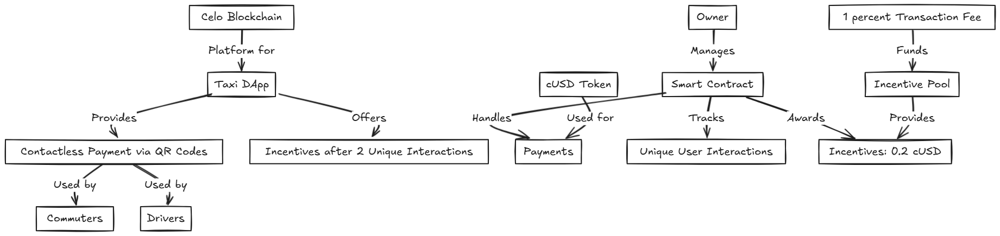
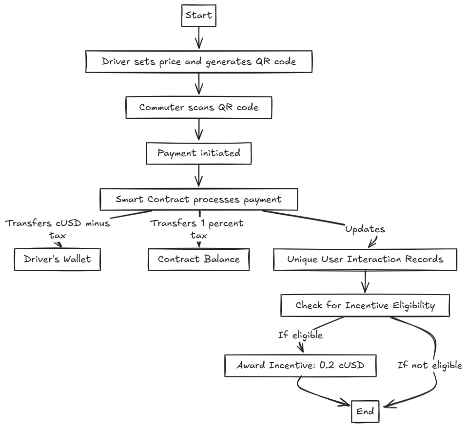
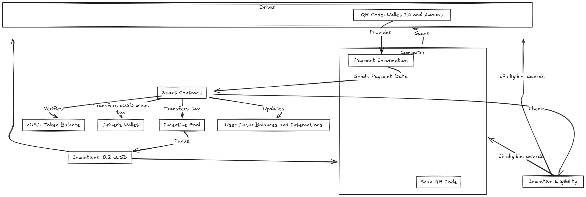

# 🚖 **Taxi dApp - Decentralized Payment System** 🚖

## **Project Overview**

Welcome to the **Taxi dApp**, a decentralized application designed to revolutionize contactless payments in the taxi industry. Leveraging the power of the **Celo blockchain** and is built using **Next.js** and **Yarn**. This app ensures secure, fast, and efficient transactions between commuters and drivers through QR code technology.

---

### **Project Highlights**

- **Blockchain**: Built on **Celo** to ensure secure, decentralized payments.
- **Smart Contracts**: Contracts deployed on Celo's Alfajores testnet, handling transactions and incentives.
- **Incentives**: Users are rewarded with **0.2 cUSD** after interacting with 2 unique users.
- **QR Code Payments**: Fast and convenient payments using QR code technology.
- **Data Visualization**: Payment and incentive data are fetched and displayed using **The Graph**.

---

## 📈 Business Model Overview
The Taxi dApp facilitates contactless payments and incentivizes user interactions within the ecosystem.




### Key Components:
- **Drivers and Commuters**: Engage in transactions via QR codes.
- **Smart Contract**: Handles payments, tracks interactions, and awards incentives.
- **Incentive Pool**: Funded by a 1% transaction fee to reward users.
- **Celo Blockchain & cUSD**: Provides the decentralized platform and stable currency.

---

## 🔄 Process Flow
Understanding the step-by-step process from initiating a payment to receiving incentives.




### Process Steps:
1. Driver sets the fare and generates a QR code.
2. Commuter scans the QR code to initiate payment.
3. Smart Contract processes the payment:
   - Transfers cUSD (minus 1% tax) to the driver's wallet.
   - Allocates 1% tax to the incentive pool.
4. Smart Contract updates user interactions and checks for incentive eligibility.
5. Incentives are awarded if eligibility criteria are met.

---

## 📊 Data Flow
A detailed look at how data moves through the system during a transaction.



### Data Movement:
1. Commuter obtains payment info by scanning the QR code.
2. Payment Information is sent to the Smart Contract.
3. Smart Contract verifies balances, processes payment, and updates user data.
4. Incentive Pool collects taxes and funds incentives.
5. Users receive incentives after qualifying interactions.

---

## **🚀 Getting Started**

### Prerequisites
- Node.js and Yarn installed on your machine.

1. **Clone the Repository**:
    ```bash
    git clone https://github.com/Argusham/TaxiZip.git
    ```
2. **Navigate to the Project Directory**:
    ```bash
    cd packages
    ```
3. **Install Dependencies**:
    ```bash
    yarn install -W
    ```
4. **Start the Development Server**:
    ```bash
    yarn dev
    ```

5. **Compile Smart Contracts**:
    ```bash
    yarn workspace @MiniTest/hardhat compile
    ```

---

### **Smart Contract Addresses**:
- **Contract Address**: `0xAF556F1aecd2b5f2Ce7C83Da9f6B18491ce8eEA4`
- **cUSD Token Address**: `0x874069Fa1Eb16D44d622F2e0Ca25eeA172369bC1` (Celo Alfajores Testnet)

---

## **Application Features** 🌟

- **Driver Interface**: Generates QR codes for fare amounts.
- **Commuter Interface**: Scans QR codes to complete transactions.
- **Incentive System**: Users receive incentives after multiple interactions.
- **GraphQL Integration**: Retrieve and display payment and incentive data.

---

## **What’s Next?**

- **Split Fare Payments**: A feature allowing commuters to split fares with friends.
- **Daily Driver Report**: Drivers can view their daily earnings and past transactions.

---

## **Pitch Deck & Demo Videos**

- [https://docs.google.com/presentation/d/1Rjn4HUlv2up2dEMyi_RhBr-4FaJ1QxutRoUr3W_yifw/edit?usp=sharing] 📊
- [https://docs.google.com/presentation/d/1Rjn4HUlv2up2dEMyi_RhBr-4FaJ1QxutRoUr3W_yifw/edit?usp=sharing] 🎥

---

## **Get Started Today!**

Fork the repo and start building the future of taxi payments with decentralized technology!

---

## **License**

This project is licensed under the MIT License.
