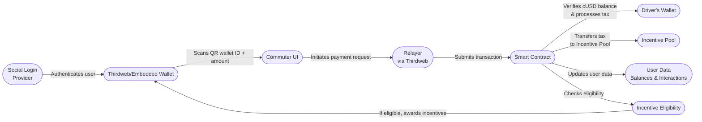

# Decentralized Taxi Payment System

## **Project Overview**

Welcome to **Tranzit**, a decentralized application that revolutionises contactless payments. Leveraging the power of the **Celo blockchain**, this app ensures secure, fast, and efficient transactions between commuters and drivers using QR code technology.

---

## **Project Highlights**

- **Blockchain**: Built on **Celo** to ensure secure, decentralized payments.
- **Smart Contracts**: Deployed on Celo Mainnet to handle transactions, incentives, and user interactions.
- **Incentives**: Users are rewarded with **0.2 cUSD** after interacting with 2 unique users.
- **QR Code Payments**: Fast and convenient transactions using QR code technology.
- **Fonbnk API Integration**: Enables cUsd-to-Airtime conversion for seamless fund access.
- **Wallet Compatibility**: Now supports embeded wallets from privy and third web for easy user onboarding.
- **Progressive Web App (PWA)**: Works seamlessly across web and mobile, even offline (Full offline mode still in the works).
- **The Graph**: Fetch and display transaction and incentive data efficiently.

   

---

## 📈 **Project Architecture**

Tranzit facilitates contactless payments while incentivizing user interactions within the ecosystem.

### **Key Components:**

- **Drivers and Commuters**: Conduct transactions via QR codes.
- **Smart Contract**: Handles payments, tracks interactions, and awards incentives.
- **Incentive Pool**: Funded by a 1% transaction fee to reward users.
- **Celo Blockchain & cUSD**: Provides a decentralized platform and stable currency.
- **Fonbnk API**: Allows users to convert cUSD into Airtime and offers an easy on and off ramp solution at a low cost.

---

## 🔄 **Process Flow**

Understanding the step-by-step process from initiating a payment to receiving incentives.

### **Process Steps:**

1. The driver sets the fare and generates a QR code.
2. The commuter scans the QR code to initiate payment.
3. Smart Contract processes the payment:
   - Transfers cUSD (minus 1% fee) to the driver's wallet.
   - Allocates a 1% fee to the incentive pool.
4. Smart Contract updates user interactions and checks for incentive eligibility.
5. Incentives are awarded if eligibility criteria are met.
6. Users can fund their wallets via Fonbnk’s airtime conversion.

---

## 📊 **Data Flow**

A detailed look at how data moves through the system during a transaction.

### **Data Movement:**

1. The commuter scans the QR code to obtain payment info.
2. Payment details are sent to the Smart Contract.
3. Smart Contract verifies balances, processes payments, and updates user data.
4. Incentive Pool collects transaction fees and funds incentives.
5. Users receive incentives after qualifying interactions.

---

## **Smart Contract Addresses**:

- **Contract Address**: `0x7f8EFB57b228798d2d3ec3339cD0a155EB3B0f96` (CELO MAINNET)
- **cUSD Token Address**: `0x765de816845861e75a25fca122bb6898b8b1282a`

---

## **Application Features** 🌟

- **Driver Interface**: Generates QR codes for fare amounts.
- **Commuter Interface**: Scans QR codes to complete transactions.
- **Incentive System**: Users receive incentives after multiple interactions.
- **GraphQL Integration**: Retrieve and display payment and incentive data.
- **Fonbnk Integration**: Converts airtime to cUSD for easier onboarding.
- **Embeded Wallet Support**: Works with Privy and thirdweb embeded wallets.
- **Progressive Web App**: Ensures UI accessibility even when offline.

---

## **What’s Next?**

- **Gasless Transactions**: Enabling meta-transactions for frictionless payments.
- **Privy Authentication: Enables social login with emails.**
- **Khule (AI to help users learn / onboard and resolve any issues users might encounter while paying)**
- **Better progress reporting on transaction loading time.

---

## **Pitch Deck & Demo Videos**

- [New Pitch Deck](https://docs.google.com/presentation/d/1n6DtycvlVZmMjKasG2TDMJJAXryVE9MURMjI075zZbU/edit?usp=sharing) 📊
- [Demo Video](https://drive.google.com/file/d/1sUSVjUryNuVvwjmNhnyJK0ThjuIWZ1Id/view?usp=sharing) 🎥
- [Loom video run through] (https://www.loom.com/share/ac41f7d9480c4c608ce250afa4270be2?sid=e9f77ec6-ce55-4b60-9ef5-d3f649e09c06)

---

---

## **License**

This project is licensed under the **MIT License**.

